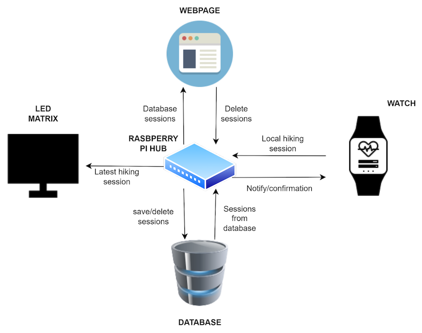
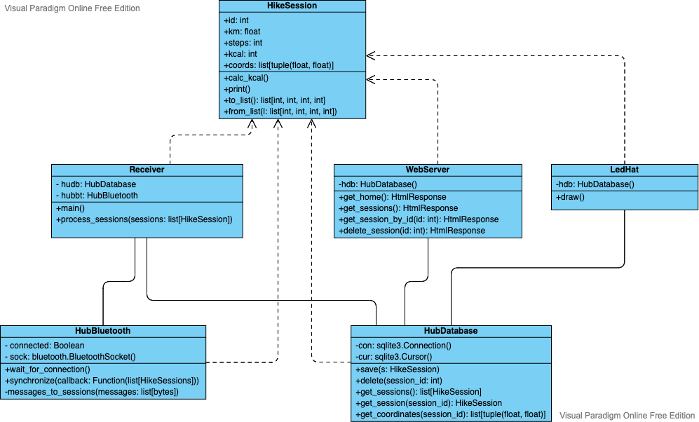

# Design documentation

## 1. Hub software design
The design for the system consists of three major components:
- Receiver
- LED controller
- Web Server

All of these are running in different processes but they share the same database concurrently.



### Class Diagram



#### HikeSession
The common object that every class uses to represent a hiking session.

#### HubDatabase
The interface for the underlying sqlite3 database. Any class or object extending the current design should use this to access the underlying database.

#### HubBluetooth
Implements the pairing and synchronization protocol to communicate with the Watch, and translates the incoming messages to hiking sessions. This class also handles all the communication going through Bluetooth.

#### Receiver
Represents the process that handles the communication with the Watch through the HubBluetooth class. This is the class that receives the interpreted incoming sessions and processes them.

#### WebServer
Represents the process that serves the website. It connects to the database, retreives hiking sessions, and creates the option to delete the hiking session.

#### LedHat
Represents the process that controls the LED hat on top of the Hub. It has access to the database and it polls the database for any changes, after it has successfully drawn the currently retreived session.

## 2. Watch software design

The design of the watch firmware is  based on a finite state machine, and the transition between the states is mainly performed by an interrupt attached to the side button on the watch.

To implement most of the functionalities on the watch, the TTGO library has been used.

### The main watch components 

#### initHikeWatch

Takes care of initalizing the watch objects for the system to work

#### sendSessionBT

Orchestrates the sending of the locally stored hiking data via the Bluetooth connection  

#### Other components

To save the data onto the watch memory, the `littleFS` library has been used.

## 3. Bluetooth communication
### MAC addresses of the test devices
Watch: `44:17:93:88:D1:D2`  
Hub: `B8:27:EB:64:86:8D`

### Pairing and initiating synchronization
When the Hub connects successfully to the Watch, it will send one `c` (ASCII character) to notify the Watch of the connection. If the Hub doesn't receive any data in 1 second, then it will retry sending a `c` character. The Hub does this until it receives data, or the connection breaks.

### Synchronization data
After an initiated synchronization, the Watch will try to send the hiking session stored locally to the Hub if there is no on-going session being recorded.
If the session was successfully send to the Hub, the Watch will delete it.

The following represents the message that the Watch will send to the Hub.
```python
# id;steps;km;lat1,long1;lat2,long2;...\n
b'4;2425;324;64.83458747762428,24.83458747762428;...,...\n'
```
- The newline represents the end of the session synchronization message

After the Hub successfully receives the session data the Hub sends one `r` (ASCII character) that represents *received*.
The watch has a timeout of 2 seconds. If the watch doesn't receive an `r`