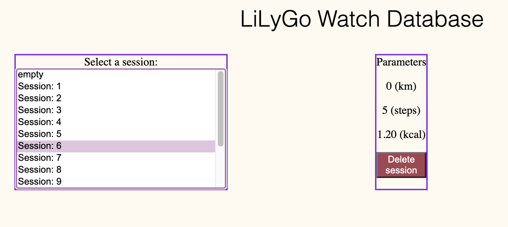

# Manual

The goal of this document is to familiarize the user with the system and to help with the setup process.
The first part of the document will describe the steps that the user is required to accomplish in order for the system to be up and running. The second part will decribe the how operate the hub and the watch.

## General description

The system's goal is to record hiking sessions on the TTGO SmartWatch and synchronize them with the Raspberry Pi so that the user can analyze them afterwards.

### Main features of the system

1. Record hiking session with the following characteristics
    - Step count
    - Covered distance
2. Storing past session on the hub with the ability to
    - Visualize last session characteristics on the LED Display
    - Delete and check past sessions in a web page
    - The web page and LED display also have the capability to show the burned Kcal on for a specific session

## Components of the system

The system is comprised by the following components:

- TTGO SmartWatch V2
- Raspberry Pi 3B+
- Pimoroni LED Display

### Optional components

In order to use the website, the user will need a computer with an internet connection and a LAN cable to connect the Raspberry Pi to the local network.

**Note**: The Raspberry Pi and Hub terminology has been used interchangeably.

## Setting up the Hub

1. Connect the Raspberry Pi to the local network via an Ethernet cable
    - It is recommended to use an Ethernet cable of category 5 or better
2. Connect the Raspberry Pi to power via the provided power supply
3. Use a tool like [fing](https://www.fing.com/) to find the local IP address of the Raspberry Pi
4. Access the webpage by using [Google Chrome](https://www.google.com/chrome/) and type the local IP address of the Raspberry Pi and the `:5000` at the end
    - e.g. `192.168.1.110:5000`
5. If the web browser is able to open the webpage, then the setup has been successful

## Using the Hub and the Watch

After the Hub has been set up, it's time to go for a hike!

### Recording hiking session on the watch

1. To start the watch, the side button needs to be pressed for at least 3 seconds
2. After the welcome message is shown on the watch, we are ready to go record a hiking session
3. To start the session, press the side button again
4. The watch will initialize the session, and you are ready to record your session
5. On the watch screen, you will be shown the following content:
    - Current step count
    - Current covered distance
6. When the user desires to end the session, he has to press again the side button
7. In order for the hiking session to be not overwritten, the user has to sync the watch with the Hub

### Syncing hiking session with the Hub

1. First, we have to make sure that a hiking session was recorded
2. The watch will sync its last session if there is no ongoing session
3. To start syncing the session, the user has to be in proximity to the Hub (2 meters without any obstables between)
4. The Hub will automatically take care of pairing with the watch, and synchronize the session
5. The watch will show a message when the synchronization was successful

### Visualizing the sessions on the web page

1. To visualize the sessions, the user has to access the webpage by typing the local IP address of the Raspberry Pi (see Section Setting up the Hub)
2. While on the web page, the user can visualize and delete stored sessions 

